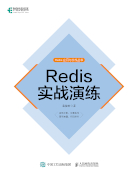
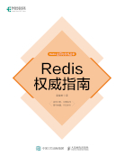
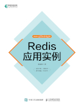
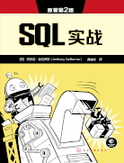
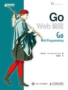

.. huangz.works documentation master file, created by
   sphinx-quickstart on Sat Feb 24 11:11:40 2024.
   You can adapt this file completely to your liking, but it should at least
   contain the root `toctree` directive.

.. image:: images/desk.jpg
   :width: 100pc

黄健宏的个人主页（huangz's personal homepage）
=================================================

关于我
--------------

黄健宏（huangz），计算机技术图书作者、译者。现居广东清远。

联系方式：
`微博 <https://weibo.com/u/3219474004>`_\ 、
`twitter <https://twitter.com/huangzworks>`_\ 、
huangzworks@gmail.com、
`微信 <wechat.html>`_

相关链接：
`GitHub <https://github.com/huangzworks>`_\ 、
`博客 <https://huangz.blog/>`_\ 、
`脑图 <./mindmap/>`_ 、
`bilibili <https://space.bilibili.com/240200009>`_\ 、
`豆瓣 <https://www.douban.com/people/273300993>`_\

.. image:: images/avatar.png
   :scale: 80

著作
------------

《Redis实战演练》（预计2025年下半年出版）

《Redis权威指南》（预计2025年下半年出版）

`《Redis应用实例》 <https://huangz.works/rediscookbook/>`_

.. image:: images/redisguide.png
   :target: https://huangz.works/redismanual/

`《Redis使用手册》 <https://huangz.works/redismanual/>`_

.. image:: images/redisbook1e.jpg
   :target: https://huangz.works/redisbook1e/

`《Redis设计与实现》 <https://huangz.works/redisbook1e/>`_

译作
-------------

`《SQL实战》 <https://huangz.works/sql/>`_

.. image:: images/gpwg.jpg
   :target: https://huangz.works/gpwg/

`《Go语言趣学指南》 <https://huangz.works/gpwg/>`_

`《Go Web编程》 <https://huangz.works/gwp/>`_

.. image:: images/ria.png
   :target: https://huangz.works/ria/

`《Redis实战》 <https://huangz.works/ria/>`_

课程
----------------

`《Redis应用十讲》 <https://huangz.works/course/redisusages/>`_

荣誉/奖项
----------------

- 2017年，人民邮电出版社异步社区“年度优秀译者”
- 2019年，机械工业出版社华章公司“优秀合作伙伴”
- 2020年，人民邮电出版社异步社区“年度最具影响力译者”
- 2023年，人民邮电出版社“建社70周年优秀作译者”
- 2024年，人民邮电出版社异步社区“年度影响力作者”
- 2024年，机械工业出版社华章分社“机工创作之星”
